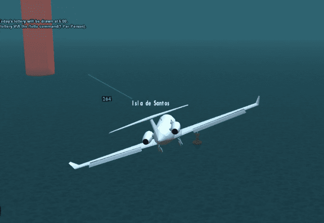

## What
HUD kind of thing that shows runways, specifically for [the pilot's life SA:MP server](http://thepilotslife.com).

[short demo video](https://youtu.be/4AXkKAutmwo)

## Requirements
[CLEO4](http://cleo.li) and [yugecodes.cleo](../../cleoplugins/yugecodes/bin/yugecodes.cleo?raw=true)

## Controls
* <kbd>F10</kbd> enable/disable
* <kbd>Y+F10</kbd> increase viewdistance
* <kbd>H+F10</kbd> decrease viewdistance
* <kbd>G+F10</kbd> enable/disable smart mode

Smart mode = only show runways in range of the (un)loading point.

Initial settings:
* enabled: no
* view distance: 1000m
* smart mode: on
