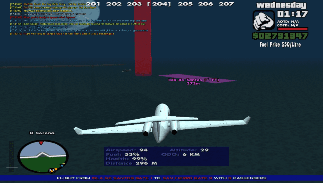

## What
HUD kind of thing that shows runways, specifically for [the pilot's life SA:MP server](http://thepilotslife.com).

This is the successor of [the old plhud](../), with a lot of improvements:
* no ghosting
* does not affect SA-MP textdraws opacity
* airstrips on the radar are updated instantly
* easy menu instead of lists of hotkeys
* configurable color
* no need for a plugin anymore, just 1 cs file
* runways stay on the screen longer, even if one end isn't visible
* better performance

[short demo video](https://youtu.be/RtfCMnLkYAk)

## Requirements
[CLEO4](http://cleo.li)

## Controls
* <kbd>F10</kbd> enable/disable, shows menu when enabling
* Arrow keys to navigate the menu

Smart mode = only show runways in range of the (un)loading point.
