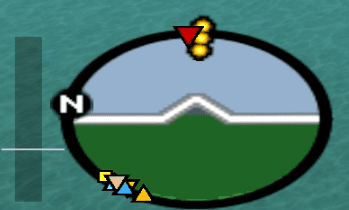

## What
CLEO script that show runways from [the pilot's life SA:MP server](http://thepilotslife.com) in the minimap radar.

[short demo video](https://youtu.be/_pCwW5apmGc)

## Requirements
[CLEO4](http://cleo.li)

## Controls
* <kbd>F11</kbd> enable/disable
* <kbd>G+F11</kbd> enable/disable smart mode

Smart mode = only show runways in range of the (un)loading point (enabled by default).
